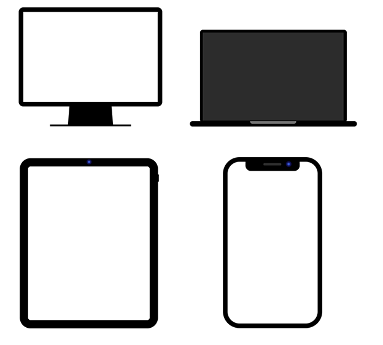

# CSS & SVG Device Shapes
This a collection of responsive, lightweight CSS & SVG device shapes. The goal here was to create responsive device shapes with minimal markup and to keep filesize as small as possible. 
I also wanted to embed html content within the device screens so CSS is easier to work with than SVG for that. It's as simple as doing this:

```
<div class="desktop">
   <div class="content">
       <!-- html content goes here e.g. youtube embedded iframe -->
   </div>
</div>
```

Demo of the end result here: https://jsfiddle.net/my1bakL7/

---

##### Screenshot of all 4 devices


